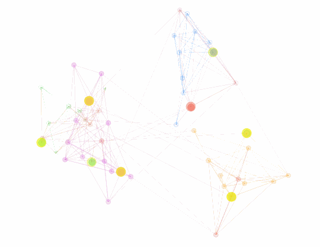

# SpikingNetworkSimulation

**Biologically Inspired Spiking Neural Network Simulation**

Minimal Python experiment simulating a brain-inspired spiking neural network with dynamic connectivity.  
It models neurons arranged in modules with excitatory and inhibitory types, simulates spike propagation with biologically plausible delays, and supports visualization and learning demos.
Visualizes how spiking activity propagates through a biologically inspired network under the effects of excitatory and inhibitory neurons.

## Features
- Spiking neural network simulation using Numpy and scikit-learn
- Modular network structure with excitatory and inhibitory neurons
- Biologically inspired spike delays and refractory periods
- Animation and visualization of spike propagation and learning (in separate modules)
- Interactive learning demos to understand sequence learning via spike-driven plasticity

## Demo Simulation

<p align="center">
  
</p>

## Project Structure

```
SpikingNetworkSimulation/
│
├── brainnet/
│ ├── init.py
│ ├── model.py # Core network building and spiking simulation
│ ├── animation.py # Visualization and animation utilities
│
├── example_run.py # Basic simulation run example
├── example_learn.py # Interactive learning demo with visualization
├── README.md
└── requirements.txt
```

## Quickstart

### 1. Install requirements:
```sh
pip install -r requirements.txt
```

### 2. Run a basic spiking network simulation:
```sh
python example_run.py
```

### 3. Run the interactive learning demo:
```sh
python example_learn.py
```

Sequence learning by strengthening connections via spike timing-dependent plasticity

Visualization of network connectivity and spike propagation over time

**Feel free to explore, extend, and experiment with SpikingNetworkSimulation!**

